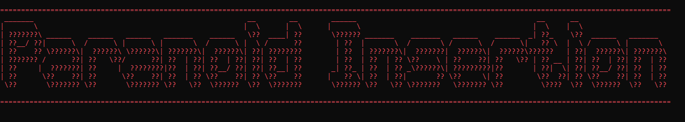

***
# The Paranoid plaintext insertion

This is a a python script I made for an old project 6 years ago that takes plaintext in a way that Keyloggers or in general monitoring cannot get the plaintext easily, the potential attacker needs to compare every array instance with the input the user gave, if of course has both the arrays and the input

It has many security leaks such as if the attacker manages to read the variables from the script live he would also be able to know the plaintext without even comparing the arrays with the input

The purpose of this repo is mainly archival but also I would like it to be public and maybe with the knowledge I have now in cyber security I could one day fix it up.

# Usage
If you would like to use it you can simply clone the repo and run the script with python, The 2 external modules I have are in Paranoia_lib so it doesn't need any other installation

But if in the future those modules need an update for the new python versions you can pip install them. The modules are colorama and pwinput

